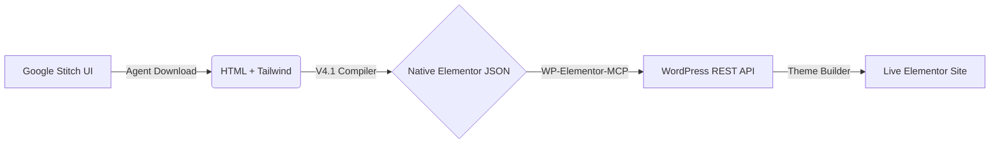

<div align="center">
  <h1>🔌 stitch2elementor V2.1</h1>
  <p><b>The ultimate Agentic AI Pipeline: From Google Stitch HTML to Native WordPress Elementor Pages automatically. 100% Free, Zero Premium Plugins.</b></p>

  [](https://opensource.org/licenses/MIT)
  [](https://github.com/google-deepmind/antigravity)
</div>

---

## 🎯 What is this?

**stitch2elementor** is a specialized prompt skill designed for LLM Agents (like Antigravity, Cline, or Claude). It orchestrates a fully automated conversion pipeline that takes UI designs generated by **Google Stitch**, extracts the raw HTML layout, compiles it down to **Native Elementor Flexbox JSON arrays**, and injects it straight into your WordPress site through the REST API.

No more manually recreating AI-generated designs block by block in Elementor. No more paying for expensive Figmentor or UiChemy plugins.



## ✨ Key Features

- **Native Elementor Flexbox Containers:** It does not use the deprecated Section/Column method. It converts Tailwind properties directly into modern Elementor Flexbox container configurations.
- **`FULL+BOXED` Auto-Architecture:** Smart layout constraints. Section backgrounds expand to 100% of the viewport width, while content cleanly adheres to an internal 1200px max-width container, identical to high-end human web development.
- **Smart Responsive Mapping:** Automatically resolves Tailwind's Mobile-First logic (`flex-col sm:flex-row`) into Elementor's Desktop-First requirements.
- **Zero Browser Overhead Policy:** Engineered to be unbelievably lightweight for LLMs. Validations and operations are performed purely via REST APIs and `curl` actions, strictly prohibiting heavy local `Playwright` instances to save your machine's resources.
- **Post-Generation Sanitization:** Includes a suite of autonomous `.js` scripts that clean up hallucinated Material Symbols, translate ephemeral Google Images (`lh3.googleusercontent.com`) to permanent WordPress Media Library IDs, and enforce SEO-friendly REST URL slugs.

## 🔀 The Dual Trigger Ecosystem

This skill teaches your AI Agent two distinct methodologies. Just tell your agent:

### 1. `go!` (The Web Maestro Pipeline)
Instructs the agent to act as a monolithic architect. It will absorb your `BrandBook`, optimize assets, generate multiple pages in Google Stitch sequentially, run the V4 JSON compilers over the batch, and inject an entire live website into WordPress including Global Headers and Footers.

### 2. `segment!` (The Modular Surgeon)
Bypasses the full-site pipeline for atomic updates. The agent singles out a specific component (e.g., just the pricing tables or a hero section), compiles a pure raw JSON array, and performs a micro-injection. Perfect for A/B testing or avoiding ModSecurity WAF blockage on massive pages.

## 🚀 Quick Start & Setup

1. **Clone the skill to your agent's directory:** Drop this repository into your chosen Agent's `.agent/skills/` folder.
2. **Setup your MCP Servers:** Your AI needs to interact with WP. Install these globally to prevent timeout errors:
   ```bash
   npm i -g wp-elementor-mcp
   npm i -g elementor-mcp
   ```
3. **Configure Authentication:** Edit your agent's `mcp_config.json` passing your WordPress URL and an **Application Password** (found in WP Admin -> Profile). See `MCP_CONFIGURATION_GUIDE.txt` for the exact block.
4. **Trigger the flow:** Talk to your agent and type `go!` or `segment!` to start the magic.

---

### Internal Tools Reference
If you're a developer extending this skill, the real intelligence lives in the `scripts/` folder:
- `compiler_v4_template.js`: The AST-like DOM Walker that transpiles HTML tags and Tailwind classes into Elementor Widget schema.
- `replace_stitch_images.js` & `apply_image_replacements.js`: Ensures hot-linked AI images are localized and permanently uploaded to the WP Media Core.
- `fix_material_symbols.js`: Purges literal text ghosts (like "arrow_forward") emitted by CSS icon fallbacks.

## 🤝 Contribution
Contributions to the V4 Elementor JSON Schema mapping are always welcome! Feel free to raise a PR.

> *Created by [@eliuhads] — Bridging the gap between Generative AI Design and Production Web Development.*
