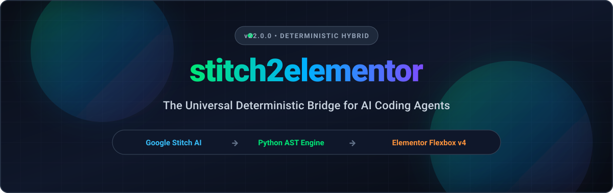
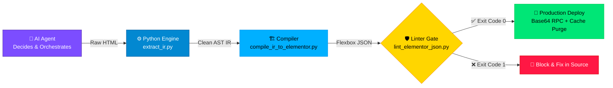
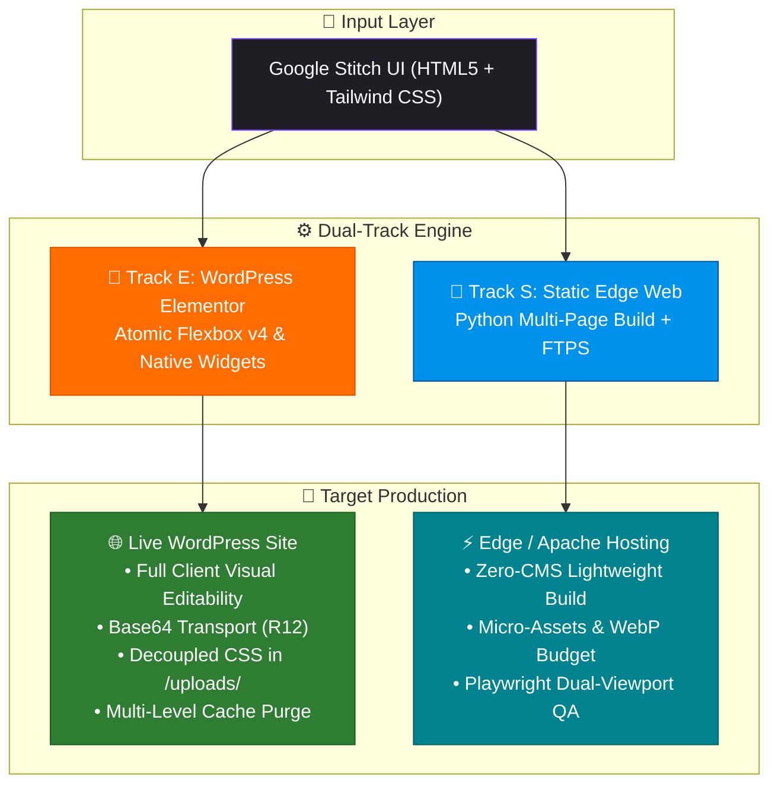

<div align="center">



# ⚡ `stitch2elementor` (v25.0.0)

### **The Universal Deterministic Bridge: Google Stitch AI ➔ WordPress Elementor & Static Web**

*Turn any AI coding agent into a zero-hallucination frontend engineer that compiles generative UI designs into production-ready, client-editable Elementor Flexbox Containers and blazing-fast Static HTML.*

[](https://floydia.site)
[](https://github.com/eliuhads/stitch2elementor/stargazers)
[](CHANGELOG.md)
[](https://github.com/eliuhads/stitch2elementor)
[](https://elementor.com)
[-3776ab.svg?style=for-the-badge&logo=python&logoColor=white&labelColor=18181b)](https://python.org)
[](LICENSE)

<br/>

[🌟 Star on GitHub](https://github.com/eliuhads/stitch2elementor) • [🚀 Quick Start](#-quick-start) • [🏛️ Architecture](#-pipeline-architecture) • [🤖 Multi-Agent Setup](#-universal-ai-agent-compatibility) • [🛡️ 22 Anti-Error Rules](#-the-22-battle-tested-anti-error-rules-r0r22)

</div>

---

## 📌 Overview

Generative UI tools like **Google Stitch** create stunning HTML5 & Tailwind layouts in seconds. But migrating those designs into real-world CMS platforms like **WordPress Elementor** has always been fraught with failures:

> [!WARNING]
> ### 🛑 The Fragile LLM Problem
> When LLMs freely write `_elementor_data` JSON or inlined styles, they suffer from:
> 1. **Schema Hallucinations**: Malformed properties, duplicate IDs, and invalid Flexbox trees that break the Elementor Canvas editor.
> 2. **Escaping Hell**: Corrupted quotes and escaped Unicode characters during API/PHP transport.
> 3. **Mobile 375px Overflow**: Horizontal scrollbars and bloated un-purged CSS caches.
> 4. **Client Lock-In**: Code dumped into monolithic raw HTML widgets instead of native, editable headings and buttons.

### 💡 The Deterministic Hybrid Solution

`stitch2elementor` decouples **high-level AI orchestration** from **AST compilation**:


```mermaid
flowchart LR
    A[🧠 AI Agent<br/>Decides & Orchestrates] -->|Raw HTML| B[⚙️ Python Engine<br/>extract_ir.py]
    B -->|Clean AST IR| C[🏗️ Compiler<br/>compile_ir_to_elementor.py]
    C -->|Flexbox JSON| D{🛡️ Linter Gate<br/>lint_elementor_json.py}
    D -->|✅ Exit Code 0| E[🚀 Production Deploy<br/>Base64 RPC + Cache Purge]
    D -->|❌ Exit Code 1| F[🛑 Block & Fix in Source]

    style A fill:#7c4dff,stroke:#512da8,color:#fff
    style B fill:#0288d1,stroke:#01579b,color:#fff
    style C fill:#00b0ff,stroke:#0091ea,color:#000
    style D fill:#ffd600,stroke:#f57f17,color:#000
    style E fill:#00e676,stroke:#00c853,color:#000
    style F fill:#ff1744,stroke:#d50000,color:#fff
```

> **The AI Agent decides what to build, while deterministic Python scripts (stdlib only) extract, compile, and lint the tree.** Zero hallucination. 100% predictable.

---

## 🤖 Universal AI Agent Compatibility

`stitch2elementor` is completely tool-agnostic. It works out-of-the-box with any agent or workspace with terminal execution capabilities:

| AI Coding Agent | Workspace Path / Integration | Status |
|---|---|---|
| **OpenCode** | `~/.config/opencode/` · Workspace Subtools | `🟢 Verified Native` |
| **Google Antigravity** | `.agents/skills/stitch2elementor/` | `🟢 Verified Native` |
| **Claude Code (Anthropic)** | Project root `/pipeline/` via CLI tool calling | `🟢 100% Compatible` |
| **Cursor / Windsurf** | `.cursorrules` + terminal workflow | `🟢 100% Compatible` |
| **Zed Editor** | Assistant + Workspace task runner | `🟢 100% Compatible` |
| **Cline / Roo Code** | Custom system prompt + MCP toolchain | `🟢 100% Compatible` |
| **Python CLI (Standalone)** | Any shell with Python 3.10+ (No AI required) | `🟢 100% Compatible` |

---

## 🎯 Dual-Track Deployment Engine

Choose the optimal deployment path before designing:


```mermaid
flowchart TD
    subgraph Input["🎨 Input Layer"]
        UI["Google Stitch UI (HTML5 + Tailwind CSS)"]
    end

    subgraph Tracks["⚙️ Dual-Track Engine"]
        TrackE["🔴 Track E: WordPress Elementor<br/>Atomic Flexbox v4 & Native Widgets"]
        TrackS["🔵 Track S: Static Edge Web<br/>Python Multi-Page Build + FTPS"]
    end

    subgraph Outputs["🚀 Target Production"]
        WpLive["🌐 Live WordPress Site<br/>• Full Client Visual Editability<br/>• Base64 Transport (R12)<br/>• Decoupled CSS in /uploads/<br/>• Multi-Level Cache Purge"]
        StaticLive["⚡ Edge / Apache Hosting<br/>• Zero-CMS Lightweight Build<br/>• Micro-Assets & WebP Budget<br/>• Playwright Dual-Viewport QA"]
    end

    UI --> TrackE
    UI --> TrackS
    TrackE --> WpLive
    TrackS --> StaticLive

    style UI fill:#1e1e24,stroke:#7c4dff,color:#fff
    style TrackE fill:#ff6d00,stroke:#e65100,color:#fff
    style TrackS fill:#0091ea,stroke:#01579b,color:#fff
    style WpLive fill:#2e7d32,stroke:#1b5e20,color:#fff
    style StaticLive fill:#00838f,stroke:#006064,color:#fff
```

---

## 📊 Feature Comparison

| Engineering Dimension | ❌ Raw LLM Generation | ✅ `stitch2elementor` (v22) |
|---|---|---|
| **AST & Schema Structure** | ⚠️ Random missing keys, malformed arrays | 🔒 **100% Validated against Elementor JSON Schema** |
| **Element IDs** | ⚠️ Random IDs with collisions (breaks builder) | 🔑 **Deterministic `uuid5` (7-hex collision-proof)** |
| **Elementor Modern Standard** | ❌ Legacy Sections & Columns (`elType: section`) | ⚡ **Atomic Flexbox Containers (`elType: container`)** |
| **Client Usability** | ⚠️ Monolithic raw HTML dump (uneditable) | ✏️ **Native Widgets (`heading`, `text-editor`, `image`, `button`)** |
| **Database Footprint** | ❌ 20KB+ inline CSS duplicated per page | 📦 **Decoupled master CSS stylesheet in `/uploads/`** |
| **Mobile Breakpoints (375px)** | ❌ Frequent horizontal scroll overflow | 📱 **Mechanical `!important` mobile containment rules** |
| **Transport Safety** | ❌ Broken strings across REST / PHP APIs | 🛡️ **Base64 transport layer (Zero Escaping Hell)** |
| **Deployment Gate** | ❌ Blind deploy (pray it works) | 🚦 **Mandatory Linter with Exit Codes (0=Pass, 1=Fail)** |

---

## 🛡️ The 26 Battle-Tested Anti-Error Rules (R0–R26)

> [!NOTE]
> Every rule in this engine was forged through real-world production post-mortems across 23 major architectural iterations, backed by deep research synthesized with **NotebookLM** and persistent **Memory Bank** logs.

<details>
<summary><b>🔍 Expand to inspect all 26 Anti-Error Rules</b></summary>

<br/>

| Rule | Area | Summary & Production Guarantee |
|:---:|---|---|
| **R0** | **Mode Selection** | Select Track E (CMS) or Track S (Static) **before** design begins. Never cross-contaminate. |
| **R1** | **FTP Probe** | Mandatory `probe.html` verification to resolve docroot mismatch (`/` vs `public_html/`) before payload transmission. |
| **R2** | **Source Separation** | `src/` is the single source of truth. The `site/` folder is completely ephemeral and safe to regenerate. |
| **R3** | **Immutable Build** | Never patch generated output files directly. Fix source templates in `src/` and re-run compilation. |
| **R4** | **Golden Dimensions** | Strict caps: Navbar logo `48px (±8px)`, social icons `28px`, WA floating button `56px`. Measured via DOM. |
| **R5** | **Native SEO Injection** | Auto-injects canonical link, OpenGraph tags, and structured JSON-LD schemas on every page build. |
| **R6** | **Brandbook Token Anchor** | Enforces `1240px` boxed layouts, client typography, and palette variables directly from Brandbook. |
| **R7** | **Atomic Batches** | Deploy complete bundles atomically. Partial, halfway deployments are strictly blocked. |
| **R8** | **AI Asset Matrix & WebP** | Budget caps (Heroes <130KB, Cards <90KB) with `asset_matrix.py verify` exit=0 quality gate. |
| **R9** | **No Hand-Crafted JSON** | Prohibits free-form LLM JSON synthesis. All payloads must emerge from `compile_ir_to_elementor.py`. |
| **R10** | **Mechanical Responsive** | Compiler automatically injects `flex_direction_mobile: column` and `width_mobile: 100%`. |
| **R11** | **Deterministic Contracts** | Every stage outputs a verified JSON artifact + exit code. 2 consecutive fails trigger human escalation. |
| **R12** | **Base64 Safe Transport** | Empaqueta HTML/JSON con `base64_encode`/`decode` para eliminar el *Escaping Hell* en RPC/PHP. |
| **R13** | **CSS Decoupling** | Centraliza hojas de estilo maestras en `/uploads/` con hash de versión, eliminando el bloat de BD. |
| **R14** | **Novamira Multi-Level Cache Purge** | Purga obligatoria vía Novamira MCP: `wp elementor flush-css` y `wp cache flush`. |
| **R15** | **Mobile Specificity** | Reglas `!important` inmutables para `box-sizing` y wrappers en 375px. Rechaza builds con `isOverflow: true`. |
| **R16** | **Canvas Reset** | Resetea fondos y márgenes residuales de wrappers globales de Elementor. |
| **R17** | **Atomic Flexbox Containers** | Migración total a `elType: "container"` con Flexbox nativo; elimina secciones/columnas legacy. |
| **R18** | **Native Editable Widgets** | Mapea semánticamente a widgets visualmente editables (`heading`, `text-editor`, `image`, `button`). |
| **R19** | **SVG Dimensional Hardening** | Prohíbe SVGs con lienzos gigantes (1985×2066) sin rasterizar a PNG/WebP (360×375) o sin `max-height: 38px !important`. |
| **R20** | **Forced Contrast & Fallbacks** | Fondos sólidos de respaldo (`bg-[#0F3D24]`), badges ámbar (`#FBBF24`) y texto de alto contraste (`#E2EFE7`). |
| **R21** | **Immediate Load Bento Cards** | Erradicación de `loading="lazy"` en tarjetas de catálogo de portada para evitar recuadros blancos. |
| **R22** | **Realistic Visual QA Gate** | Prohibido dar PASS solo por HTTP 200; autoScroll mandatorio e inspección de capturas en Proxmox CT252. |
| **R23** | **Out-of-Band Transport** | Payload `_elementor_data` via filesystem (`wp-content/uploads/s2e_payloads/`) + hash SHA256; el contexto LLM solo transporta rutas. |
| **R24** | **Multilevel Purge E4.5** | `purge_and_verify.py`: flush-css → cache flush → `Endurance_Page_Cache::purge_all()` vía Novamira, verificado por marcador ALT y hash CSS. |
| **R25** | **Schema Freshness** | El compilador bloquea si `elementor_schema.json` supera 14 días (`probed_at`); escape `--allow-stale-schema`. |
| **R26** | **Total Editability E13** | El linter rechaza widgets HTML opacos cuando existe widget nativo migrable (`heading`, `text-editor`, `image`, `button`). |

</details>

---

## ⚡ Interactive Command Menu

<details>
<summary><b>🖥️ View Interactive Agent CLI Menu</b></summary>

```text
=====================================================================
      ⚡ STITCH2ELEMENTOR v22.0 — DETERMINISTIC AGENT PIPELINE ⚡
=====================================================================
Target Mode:  [E] Elementor Canvas (WP)  |  [S] Static HTML (Python)
=====================================================================
 [1] Ingest brandbook + copy + assets (Brand System)
 [2] Audit inputs and gaps (logo, palette, typography, photography)
 [3] Generate screens in Google Stitch MCP (desktop + design system)
 [4] Extract raw HTML/CSS from Stitch to local workspace
 ─────────────────────────────────────────────────────────────────
 Mode E (Elementor Canvas):
 [5E] E1+E2: extract_ir.py → compile_ir_to_elementor.py (Flexbox Containers)
 [6E] E3: lint_elementor_json.py (Exit=0) → E4: Base64 Deploy & Cache Purge
 ─────────────────────────────────────────────────────────────────
 Mode S (Static HTML):
 [5S] Build static pages (src/ → site/ via Python pages.py)
 [6S] Deploy static site via FTPS to target server subfolder
 ─────────────────────────────────────────────────────────────────
 [7] Post-Deploy QA (HTTP 200 checks + Playwright dual-viewport audit)
 [8] SEO Engine (Structured JSON-LD + OpenGraph + Meta verification)
 [9] Component Lab (Header, Footer, Floating WhatsApp, Social Matrix)
 [10] Free / Custom Execution
=====================================================================
```

</details>

---

## 🚀 Quick Start

### 1. Clone Repository
```bash
git clone https://github.com/eliuhads/stitch2elementor.git
cd stitch2elementor
```

### 2. Run Deterministic Compilation (CLI)
```bash
# Step E1: Extract Clean Intermediate Representation
python3 pipeline/extract_ir.py input_stitch.html -o ir.json

# Step E2: Compile AST to Atomic Flexbox Elementor Tree
python3 pipeline/compile_ir_to_elementor.py ir.json -o page_elementor.json

# Step E3: Run Mandatory Quality Gate Linter
python3 pipeline/lint_elementor_json.py page_elementor.json
# Output: Exit Code 0 (PASS) ➔ Ready to deploy!
```

### 3. Agent Integration
Copy `SKILL.md` and the `pipeline/` directory into your agent workspace (e.g., `.agents/skills/stitch2elementor/` o configuración de OpenCode/Cursor) y permite que tu agente opere con total autonomía determinista.

---

## 🤝 Community & Support

`stitch2elementor` is an open-source engineering initiative by **[Floydia](https://floydia.site)** for the modern AI pair-programming era.

* 🌟 **Star this Repo**: If this tool saves you hours of UI debugging, please leave a star!
* 🐛 **Report Issues**: Found a specific Elementor edge-case? Open an [Issue](https://github.com/eliuhads/stitch2elementor/issues).
* 💡 **Pull Requests**: Compiler optimizations, new widget handlers, and agent presets are welcome!

---

<div align="center">

<a href="https://floydia.site">
  
</a>

**Crafted with precision for the Agentic Coding ecosystem.**  
Created & Maintained by **[Floydia](https://floydia.site)** • [@eliuhads](https://github.com/eliuhads) • Distributed under the [MIT License](LICENSE)

</div>
