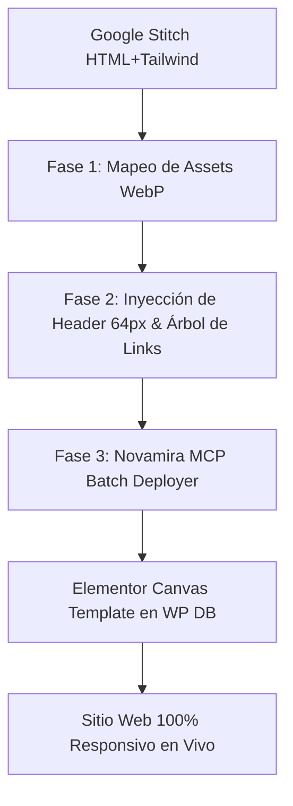

# 🚀 Stitch to Elementor Skill (v3.1.0 Novamira MCP Powered)

## 📌 Descripción
Skill avanzado para **Antigravity AI Agent** diseñado para traducir e inyectar de forma atómica sitios web completos diseñados en **Google Stitch** (HTML5 + Tailwind CSS) a **WordPress Elementor** utilizando **Novamira MCP**.

Garantiza paridad visual del 100%, navegación jerárquica activa, sustitución automática de imágenes por formatos `.webp` y proporciones estilizadas de interfaz.

---

## ⚡ Reglas de Interfaz y Proporciones (v3.1.0)

| Elemento | Especificación | Clase / Valor |
|---|---|---|
| **Contenedor Navbar** | Altura fija compacta | `h-16` (64px) |
| **Logo Corporativo** | Altura responsiva sutil | `h-7 md:h-8` (28px - 32px) |
| **Offset `<main>`** | Padding superior | `pt-16` |
| **Imágenes** | Formato y Optimización | WebP local/servidor obligatorio |
| **Botón WhatsApp** | CTA compacto esmeralda | `#25D366`, SVG oficial, `11px` |

---

## 🏗️ Arquitectura del Pipeline

```mermaid
graph TD
    A[Google Stitch HTML+Tailwind] --> B[Fase 1: Mapeo de Assets WebP]
    B --> C[Fase 2: Inyección de Header 64px & Árbol de Links]
    C --> D[Fase 3: Novamira MCP Batch Deployer]
    D --> E[Elementor Canvas Template en WP DB]
    E --> F[Sitio Web 100% Responsivo en Vivo]
```

---

## 🛡️ Protocolo de Seguridad y Saneamiento
- Ejecución limpia sin dejar scripts PHP/JS temporales en la carpeta de producción ni en el servidor sandbox.
- Gestión segura de credenciales vía archivo `.env` del workspace.

---

## 📄 Licencia
MIT License - Creado para la suite de agentes de Antigravity AI.
