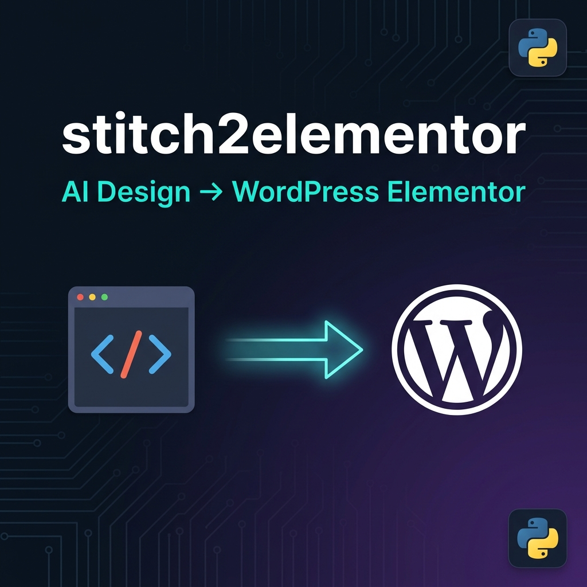

<div align="center">




<br/><br/>

```
 ███████╗████████╗██╗████████╗ ██████╗██╗  ██╗██████╗
 ██╔════╝╚══██╔══╝██║╚══██╔══╝██╔════╝██║  ██║╚════██╗
 ███████╗   ██║   ██║   ██║   ██║     ███████║  ▄███╔╝
 ╚════██║   ██║   ██║   ██║   ██║     ██╔══██║  ▀▀══╝
 ███████║   ██║   ██║   ██║   ╚██████╗██║  ██║  ██╗
 ╚══════╝   ╚═╝   ╚═╝   ╚═╝    ╚═════╝╚═╝  ╚═╝  ╚═╝
  ────────────── 2 ELEMENTOR ───────── v3.0 NOVAMIRA ─
```

### **Google Stitch → WordPress Elementor via Novamira MCP**
### **100% Pixel-Perfect & Fully Responsive Conversion Engine**

*The agentic AI skill that eliminates the gap between AI-generated design and production web.*

<br/>

[🚀 Quick Start](#-quick-start) · [⚡ Triggers](#-dual-trigger-ecosystem) · [🤖 Novamira MCP](#-novamira-mcp-engine) · [📐 Responsive Validation](#-responsive-validation) · [📦 Scripts](#-internal-tools--scripts) · [🤝 Contribute](#-contributing)

</div>

---

## 🎯 Welcome to stitch2elementor v3.0!

**stitch2elementor** is an open-source **AI agent skill** for AI platforms like [Antigravity](https://github.com/google-deepmind/antigravity), Cline, or any MCP-compatible agent. Powered by **Novamira MCP**, it orchestrates a fully automated pipeline that exports UI designs generated by **Google Stitch**, loads global branding assets via MU-Plugin, and injects **100% pixel-perfect Elementor Canvas pages** directly into WordPress — guaranteeing flawless responsive layouts across Desktop, Tablet, and Mobile devices.

> **No Figmentor. No UiChemy. No premium plugins. No manual layout fixes. Zero cost. 100% Novamira MCP Native.**

```
   ┌──────────────────┐      ┌───────────────────────────┐      ┌──────────────────────────┐      ┌─────────────────┐
   │  Google Stitch   │ ───► │  Novamira Global Assets   │ ───► │ Elementor Canvas Payload │ ───► │ WordPress Live  │
   │  AI Design UI    │      │  MU-Plugin (Tailwind CDN) │      │ Novamira MCP Ingestion   │      │ 100% Responsive │
   └──────────────────┘      └───────────────────────────┘      └──────────────────────────┘      └─────────────────┘
```

---

## ✨ Key Features (v3.0 Novamira Native)

| Feature | Description |
|---|---|
| 🤖 **Novamira MCP Engine** | **Primary server execution engine**: Executes secure PHP sandboxing (`novamira/execute-php`) and file writes (`novamira/write-file`) for direct DB injection and cache flushing. |
| 💎 **100% Pure HTML Canvas** | Injects complete HTML+Tailwind DOM trees into Elementor Canvas (`_wp_page_template = 'elementor_canvas'`), preserving full 12-column grids and glassmorphism without widget breakdown errors. |
| 🔌 **MU-Plugin Asset Injector** | Deploys `/wp-content/mu-plugins/evergreen_stitch_assets.php` to serve Tailwind CDN, brand color tokens (`#0D0D1A`, `#1A1A2E`, `#006B3F`, `#C07830`), Google Fonts (*Montserrat*, *Lato*, *Inter*), and *Material Symbols Outlined* on every page. |
| 📱 **Mandatory Responsive Check** | Enforces runtime layout verification: 4-column horizontal grids on Desktop, 2-column Tablet grids, and vertical flex stacking on Mobile. |
| ⚓ **Header & Footer Alignment** | Embeds sticky navigation (`<nav>`) with WhatsApp CTA and multi-column footer (`<footer>`) with top offset (`pt-20`) to prevent Hero overlap. |
| 💉 **WAF-Bypass Architecture** | Completely circumvents ModSecurity HTTP 406/401 errors through Novamira MCP server-side DB writes. |
| 🔄 **Atomic Cache Flush** | Instantly clears Elementor CSS cache (`\Elementor\Plugin::$instance->files_manager->clear_cache()`) and flushes rewrite rules after deployment. |

---

## ⚡ Dual Trigger Ecosystem

Just type one keyword to invoke the skill:

### `go!` — Full Site Deployment (Novamira Powered)
Executes the full pipeline: Stitch export → MU-Plugin deployment → Novamira Elementor Canvas injection → Responsive verification → Memory alignment for all site pages.

### `segment!` — Modular Component Surgeon
Targets a single section or page (Hero, Product Grid, Contact Form, Footer) and performs an isolated Novamira micro-injection without touching the rest of the site.

---

## 📐 Responsive Validation Protocol

Every deployment executed by `stitch2elementor` v3.0 adheres to strict responsive checks:

```
📱 Desktop (>=1024px)  ───► 12-Column Hero + 4-Column Card Grid + 4-Column Footer + pt-20 Header Offset
Tablet (768-1023px) ───► 2-Column Responsive Card Layout + Adaptive Spacing
📱 Mobile (<768px)     ───► Single Column Flex Stacking + Touch-friendly Buttons + Hamburger Menu
```

---

## 🚀 Quick Start

1. **Clone the Skill**:
   ```bash
   git clone https://github.com/eliuhads/stitch2elementor.git .agents/skills/stitch2elementor
   ```
2. **Set Up `.env`**:
   ```env
   FTP_HOST=ftp.yoursite.com
   FTP_USER=your_username
   FTP_PASSWORD=your_password
   WP_URL=https://yoursite.com
   ```
3. **Run Trigger**:
   - In your AI prompt, type `go!` for full site build or `segment!` for a single component.

---

## 📄 License & Author

- **Author**: Eliu (Antigravity & Novamira MCP)
- **License**: MIT License
